# Neural_Network_Charity_Analysis Overview
	Using your knowledge of Pandas and the Scikit-Learn’s StandardScaler(), we preprocess the dataset in order to compile, train, and evaluate the neural network model to aid this project in machine learning.

## Results
**Data Preprocessing**
	What variable(s) are considered the target(s) for your model?
		the variable we use as the target "IS_SUCCESSFUL" column
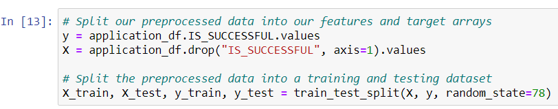

		What variable(s) are considered to be the features for your model?
			every column except for "IS_sUCCESSFUL"
		What variable(s) are neither targets nor features, and should be removed from the input data?
		
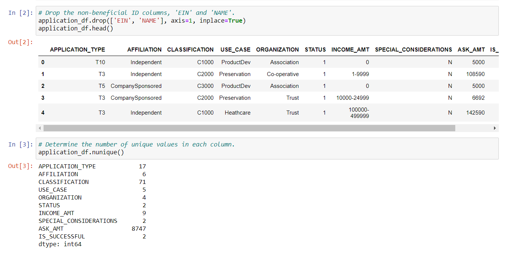		

	Compiling, Training, and Evaluating the Model
		How many neurons, layers, and activation functions did you select for your neural network model, and why?
			I used two hidden layers on my model. My first layer had 80 neurons, the second layer had 30 neurons. Using the activation "relu" and the output layer as "sigmoid"
			
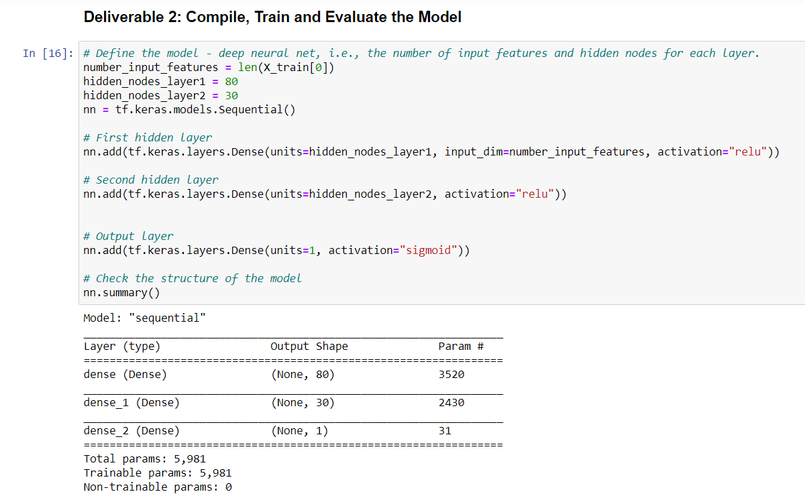

		Were you able to achieve the target model performance?
			I was not able to achieve the target model performance after three attempts the best overall was still around 72%

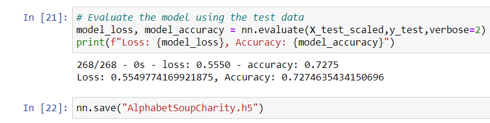

		What steps did you take to try and increase model performance?
			dropping more columns
## **step 1**
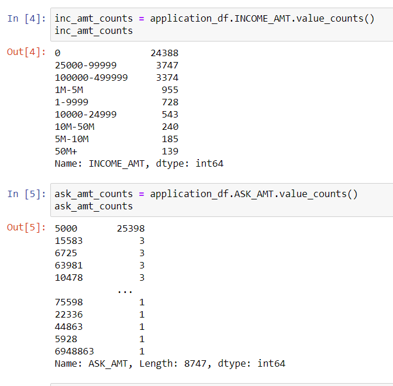

## **step 2**
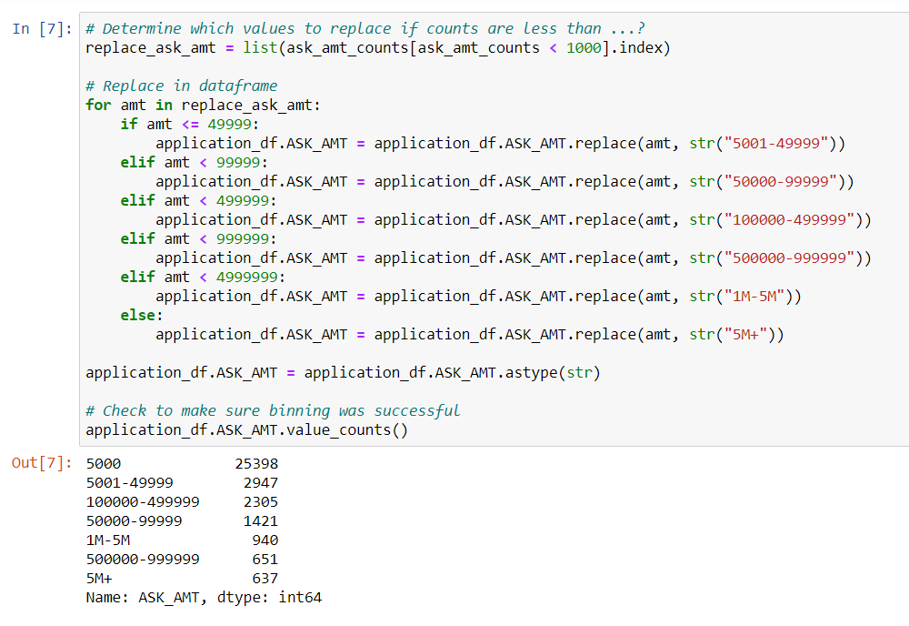

## **step 3**
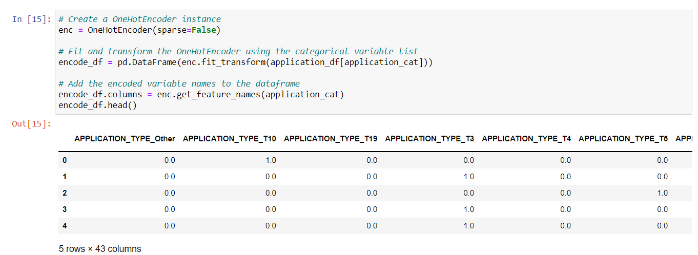

## **step 4**
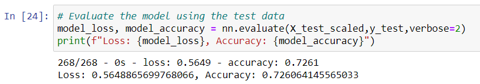

## **step 5**
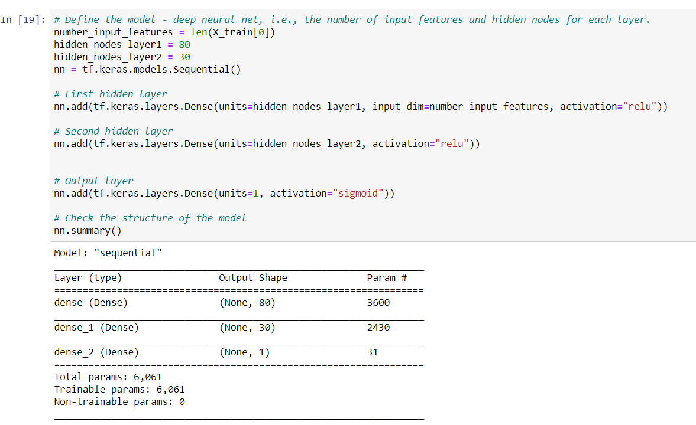

## **step 6**
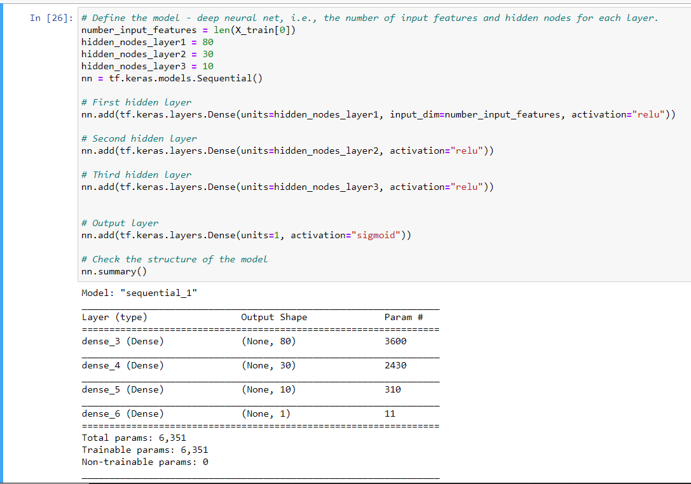
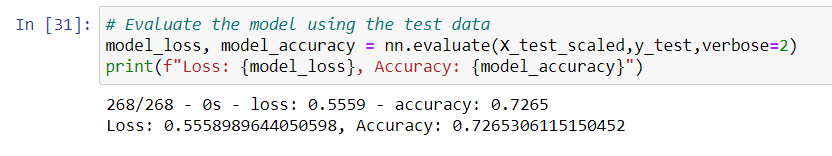

## **step 7**
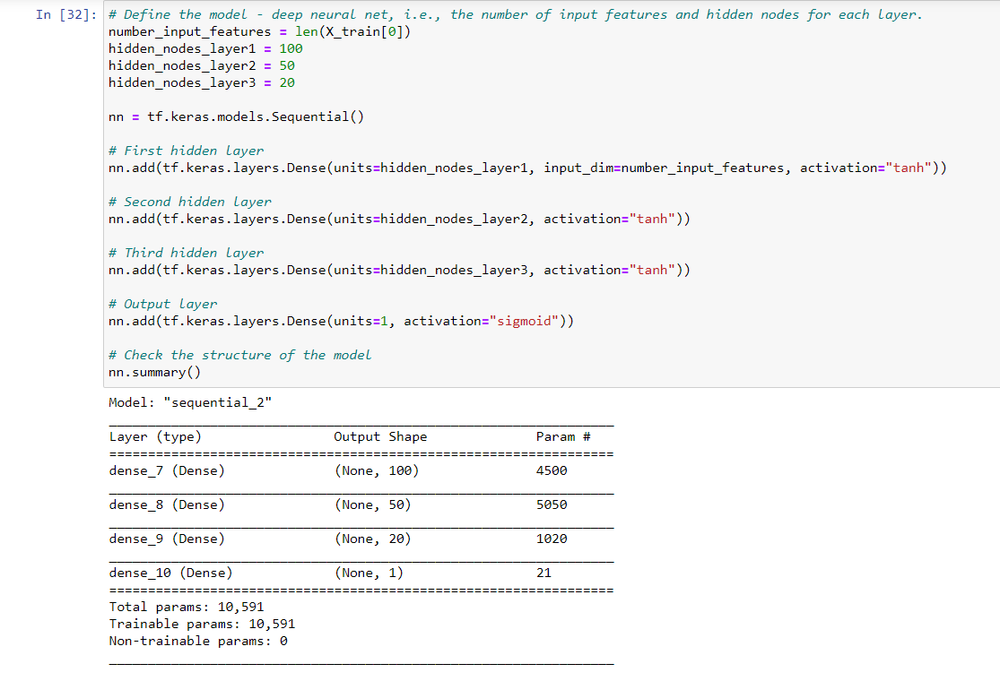
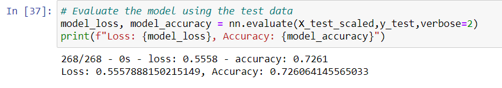
			
# Summary
	The overall results of the deep learning model never achieved the overall goal of over 75% optimization. A recommendation for how a different model could solve this classification problem would be keep dropping columns since the increase was so little when we dropped "USE_CASE".
	
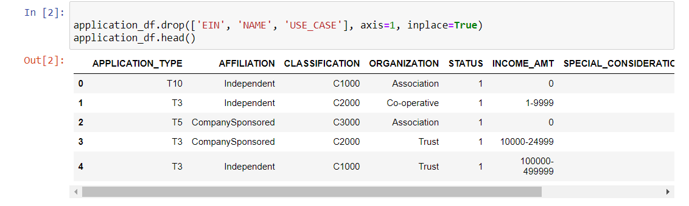
